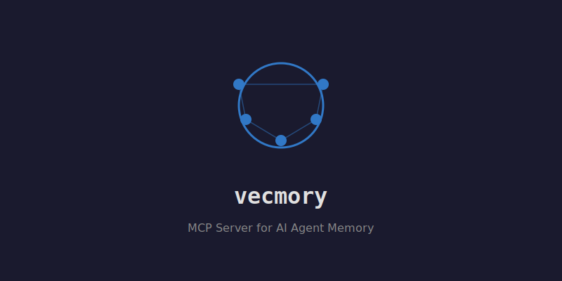

<p align="center">
  
</p>

# VecMory

MCP-сервер контекстной памяти для AI-агентов.

Хранит цепочки `запрос -> ошибка -> решение` как граф с типизированными рёбрами.
Эмбеддинг локальный (CPU, без внешних API). Данные живут в таблице [Integram](https://ideav.ru).

## Установка

```bash
# С GitHub напрямую
npm install judas-priest/vecmory

# Или с пином на конкретный коммит (для стабильности)
npm install judas-priest/vecmory#0cd238f

# Или клонировать и установить локально
git clone https://github.com/judas-priest/vecmory.git
cd vecmory && npm install
```

## Настройка

Создайте `.env`:

```env
VECMORY_BASE_URL=https://ideav.ru
VECMORY_DB=mem
VECMORY_TOKEN=your-token
VECMORY_TABLE_ID=724958
VECMORY_FIELD_TEXT=724959
VECMORY_FIELD_VEC=724960
VECMORY_FIELD_NEIGHBORS=724962
VECMORY_FIELD_CLEANED_QUERY=724978
VECMORY_FIELD_DOMAIN=724980
VECMORY_FIELD_TOPIC=724982
VECMORY_FIELD_ESSENCE=724984
VECMORY_FIELD_POPULARITY=724986
VECMORY_FIELD_DECAY=724988
VECMORY_FIELD_IMPORTANCE=724990
VECMORY_FIELD_EDGE_TYPES=724992
VECMORY_MODEL=Xenova/paraphrase-multilingual-MiniLM-L12-v2
```

### Подключение к Claude Code

> **Важно:** Claude Code не пробрасывает `env` из конфига в MCP-серверы ([#11927](https://github.com/anthropics/claude-code/issues/11927)). Используйте bash-wrapper `start-mcp.sh`, который загружает `.env` через `source`.

Добавьте в `~/.claude.json` (секция `mcpServers`):

```json
{
  "mcpServers": {
    "vecmory": {
      "type": "stdio",
      "command": "bash",
      "args": ["/path/to/vecmory/start-mcp.sh"]
    }
  }
}
```

`start-mcp.sh` входит в комплект — загружает `.env` и запускает `src/mcp-server.js`.

Инициализация (auth + загрузка модели эмбеддинга ~90MB) происходит лениво при первом вызове тулзы, не при старте MCP-сервера.

## MCP-тулзы

| Тулза | Параметры | Что делает |
|-------|-----------|------------|
| `recall` | `query`, `k?` | Семантический поиск + обход графа соседей (garland) |
| `remember` | `text`, `domain?`, `topic?`, `essence?`, `edgeType?` | Записать факт/решение в память |
| `forget` | `nodeId` | Удалить узел и очистить рёбра |
| `memory_status` | — | Статистика: total, withNeighbors, avgDegree, byDomain |

## Архитектура

```
Claude Code / AI-агент
        |
        | MCP stdio
        v
┌─────────────────────────────────┐
│  vecmory (npm, MCP-сервер)       │
│                                   │
│  MCP layer     — 4 тулзы         │
│  Embedder      — @xenova/transformers, 384-dim, CPU │
│  MemoryGraph   — узлы + типизированные рёбра        │
│  SearchEngine  — cosine brute-force                  │
│  DecayManager  — затухание неиспользуемых узлов      │
│  IntegramHTTP  — HTTP-клиент к Integram API          │
└────────────┬────────────────────┘
             |  HTTP (fetch)
             v
┌─────────────────────────────────┐
│  Integram PHP-бэкенд             │
│  ideav.ru                        │
└─────────────────────────────────┘
```

## Структура узла

Каждый узел — запись в таблице Integram:

| Поле | Тип | Описание |
|------|-----|----------|
| `text` | MEMO | Исходный текст |
| `cleaned_query` | MEMO | Очищенный текст (без ID, хешей) |
| `vec` | MEMO | Вектор 384-dim как JSON-массив |
| `domain` | SHORT | Категория: `integrations`, `infra`, `project_X` |
| `topic` | SHORT | Тип: `bug_fix`, `feature_request`, `question` |
| `essence` | SHORT | 1-3 ключевых слова |
| `popularity_counter` | NUMBER | Счётчик обращений |
| `decay_score` | NUMBER | Коэффициент затухания (0.0-1.0) |
| `importance_weight` | NUMBER | Вес важности |
| `neighbors` | MEMO | JSON-массив ID соседей |
| `edge_types` | MEMO | JSON: `{ "node_id": "SIMILAR_TO", ... }` |

## Типы рёбер

| Тип | Когда создаётся |
|-----|-----------------|
| `SIMILAR_TO` | Автоматически при записи (top-k по косинусу) |
| `CAUSED_BY` | Явно при записи |
| `FOLLOWED_BY` | Автоматически между последовательными `remember()` в сессии |
| `BELONGS_TO` | По полю `domain` |
| `REFERENCES` | По совпадению `essence` |

## Пайплайны

### remember(text, meta?)

1. Очистка текста (удаление ID, хешей, стоп-слов)
2. Эмбеддинг — 384-dim, L2-нормализация
3. Поиск top-k соседей по косинусу
4. Создание записи в Integram
5. Добавление рёбер SIMILAR_TO (forward + backward)
6. Добавление ребра FOLLOWED_BY к предыдущей записи сессии
7. Return `{ id, neighbors, scores }`

### recall(query, k?)

1. Эмбеддинг запроса
2. Cosine top-k
3. Обход рёбер на garlandDepth шагов (BFS)
4. Bump popularity_counter, reset decay_score
5. Return `{ nodes, garland, total }`

## Конфигурация

| Переменная | По умолчанию | Описание |
|-----------|-------------|----------|
| `VECMORY_TOP_K` | 16 | Кол-во результатов поиска |
| `VECMORY_GARLAND_DEPTH` | 2 | Глубина обхода графа |
| `VECMORY_DECAY_RATE` | 0.95 | Множитель затухания |
| `VECMORY_DECAY_THRESHOLD` | 0.1 | Порог архивации |
| `VECMORY_MODEL` | `Xenova/paraphrase-multilingual-MiniLM-L12-v2` | Модель эмбеддинга |

## Разработка

```bash
npm test          # запуск тестов
npm run test:watch  # watch-режим
```

## Структура пакета

```
src/
  index.js              — VecMory class (оркестратор)
  mcp-server.js         — MCP stdio сервер (4 тулзы)
  integram-client.js    — HTTP-клиент к Integram API
  embedder.js           — @xenova/transformers wrapper
  search.js             — cosine brute-force
  graph.js              — рёбра, garland, обход
  decay.js              — затухание, архивация
  cleaner.js            — очистка текста
hooks/
  pre-recall.sh         — хук UserPromptSubmit → авто-recall
  post-remember.sh      — хук Stop → авто-remember
start-mcp.sh            — bash-wrapper (загружает .env)
test/
  *.test.js             — 72 теста
```

## Зависимости

| Пакет | Зачем |
|-------|-------|
| `@xenova/transformers` | Локальный эмбеддинг (ONNX, CPU) |
| `@modelcontextprotocol/sdk` | MCP-сервер |

HTTP через `globalThis.fetch` (Node 18+). Минимум зависимостей.

## Roadmap

- [x] Claude Code хуки (auto-recall, auto-remember)
- [x] FOLLOWED_BY автосвязывание последовательных записей
- [ ] Серверный косинус через формульные колонки Integram (тип 101) — research done, формула работает
- [ ] RECURSIVE-отчёт для серверного графа — заблокирован (neighbors=MEMO, не ref)
- [ ] A/B тестирование «с памятью / без»

## Лицензия

Код: MIT — свободно использовать, форкать, менять.

Метод: патенты RU 2650032 C1 и US 11138174 B2 принадлежат ideav.ru.
MIT-лицензия патентных прав не даёт.

Если вы используете VecMory вместе с Integram (https://ideav.ru/) —
патентные права покрыты вашей лицензией Integram.
Для других сценариев: alexey.ideav@gmail.com
